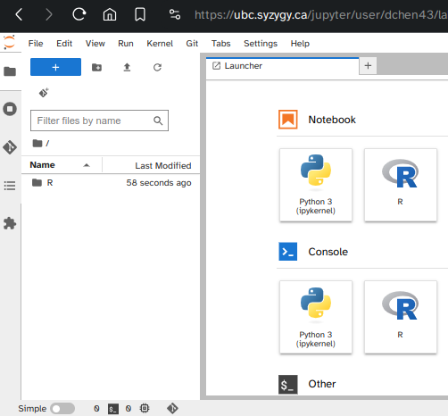
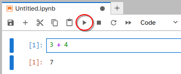
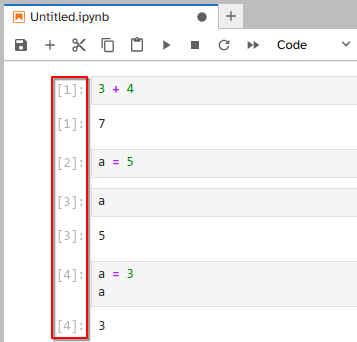
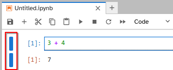
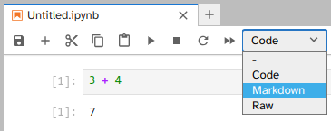
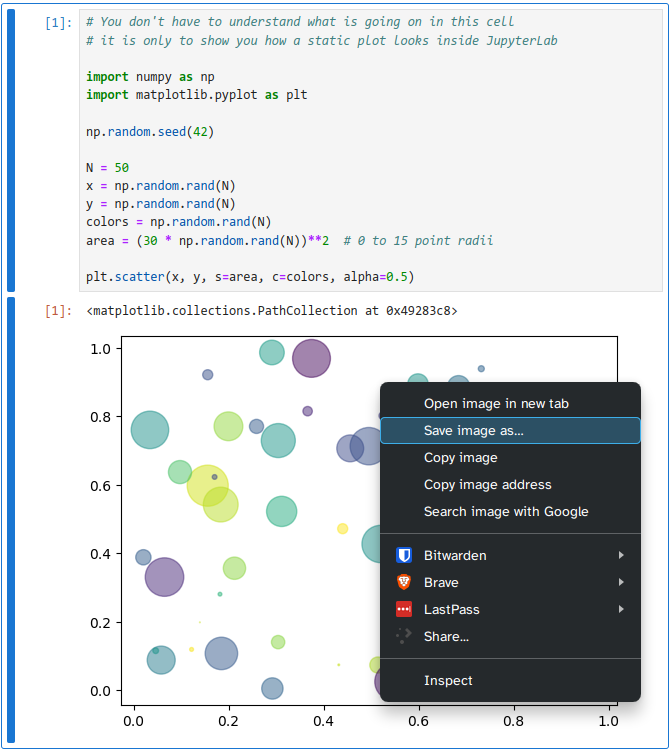
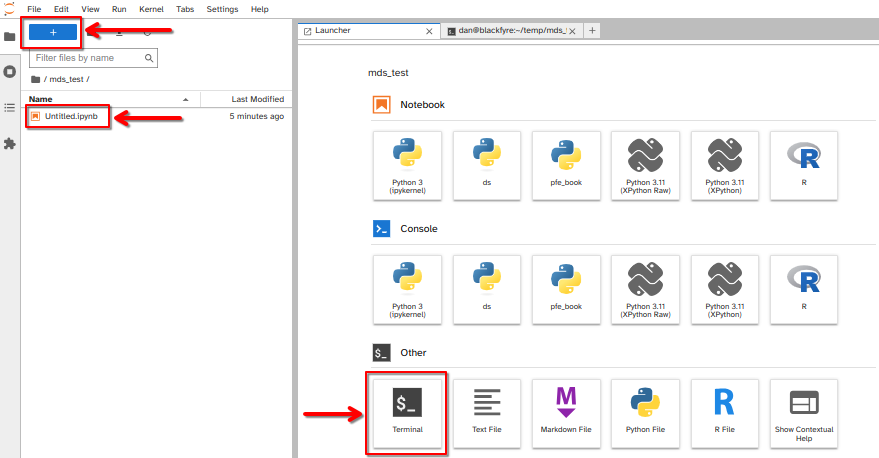
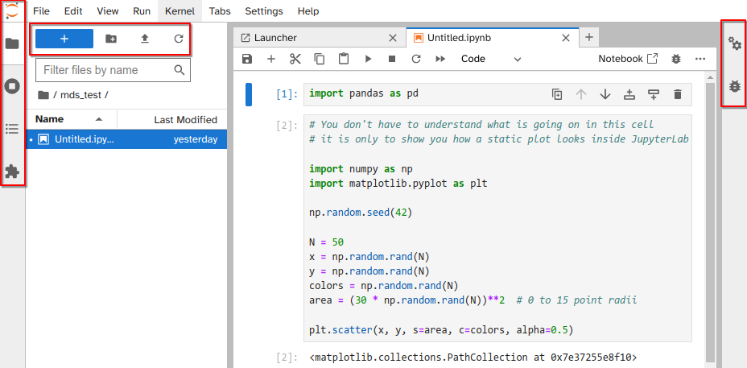

## Learning Objectives



**Platform in focus** Jupyter Lab

## What is JupyterLab

The most rudimentary interaction with programming languages
such as R and Python is via interactive shells run from a terminal.
This provides access to the full functionality of the language,
but is a barebones experience without any conveniences added.
If you want to edit a script or view a plot that you created,
you need to open a text editor and image viewer separately.

If you prefer a more holistic experience,
with many of conveniences nicely organized in the same interface,
you can use an integrated development environment (or IDE for short).
IDEs often include a
shell,
a file browser,
debugging tools,
version control,
a text editor with autocompletion and syntax highlighting,
and an area where plots show up.
A core idea of IDEs is to provide all the tools you need in one place.
Commons IDEs that you might have heard of include Visual Studio Code and RStudio.
This lesson will discuss JupyterLab,
which is and IDE to work with many programming languages,
including R, Python, Julia, and many more.
A core concept tightly linked to JupyterLab are Jupyter Notebooks,
which will be one of the main topics in this talk. Let's see how we can launch them.

## How to Access JupyterLab

You can access JupyterLab from an online remote server or a local machine.

### Online Server

We could install and run JupyterLab
just like any other program on Windows, MacOS, or Linux.
However,
one of the advantages of JupyterLab
is that it is easy to use without installing anything.
To try JupyterLab, use your web browser to visit the
[UBC Jupyter Server](https://ubc.syzygy.ca/)
and login with your CWL (Firefox, and Chrome are supported).
You can also try JupyterLab through
Project Jupyter (<https://jupyter.org/try>) or
Posit Cloud (<https://posit.cloud/>).

### Local Machine

If you have already completed the
[installation instructions](https://ubc-mds.github.io/resources_pages/installation_instructions/),
you have a program called `uv` on your machine.

What you do *not* have is a JupyterLab you can start from anywhere,
and that is on purpose.
Every assignment carries its own copy of JupyterLab,
along with the exact versions of every other package that assignment needs,
so that it works the same way on your laptop as it does on ours.

Every assignment you get in this program arrives with two extra files in it,
`pyproject.toml` and `uv.lock`,
which between them list those packages.
Starting JupyterLab is three commands,
and they are the same three commands every single time:

```bash
cd path/to/your/assignment
uv sync
uv run jupyter lab
```

- `cd` moves you into the assignment folder.
  Everything after this depends on being in the right place.
- `uv sync` reads `pyproject.toml` and `uv.lock`
  and installs the packages they list into that folder.
- `uv run` runs a command using the packages `uv sync` just installed.

The first `uv sync` in a new assignment takes a minute or so.
Every one after that is close to instant,
and it is always safe to run again.

:::{.callout-tip}
Typing out a path is fiddly before you have met the filesystem properly.
In most terminals you can type `cd ` (with a space after it)
and then drag the assignment folder onto the terminal window,
which fills in the path for you.
Moving around the filesystem is covered in
[MDS Software and Bash](1-MDStools-bash-filesystem.qmd).
:::

:::{.callout-important}
There is no step where you "activate" anything.
If a command in this course starts with
`jupyter`, `python`, or `quarto`,
put `uv run` in front of it
and run it from inside the assignment folder.
:::

We come back to what `uv` is actually doing in
[Virtual Environments: uv](7a-virtual-environments-uv.qmd).
For now, those three lines are all you need.

JupyterLab will open in a browser whether you run it locally or you are using it through UBC server.
Note that if you are running JupyterLab in your machine,
the URL could be similar to `http://localhost:8888/lab`.
In this case `localhost` is referring to your computer, not to a webpage.

#### One JupyterLab per assignment

The numbers after `localhost` is the port number.
If you have multiple JupyterLab instances running,
each of them will run on a different port.

When you start a second one,
it takes the next free port.
The first is at `http://localhost:8888/lab`,
the second at `http://localhost:8889/lab`,
and so on.

Do not reuse one terminal and one JupyterLab for all of your homework.
Each assignment gets its own terminal and its own `uv run jupyter lab`.
A JupyterLab can only see the folder it was started from,
and it can only use the packages that folder's `uv sync` installed,
so one JupyterLab cannot serve two assignments.

:::{.callout-note}
## This does not fill up your laptop

An environment with JupyterLab in it reports as about 160 MB,
and you are about to have one of them per assignment.
They are not really separate copies.

`uv` downloads each version of each package once
into a single cache in your home folder.
Every project after that gets a
[clone or a hard link](https://docs.astral.sh/uv/reference/settings/#link-mode)
of what is already in that cache
instead of a fresh copy,
so the files show up in both projects
while sharing the same blocks on disk.

Measured on a Mac while writing this:
a second project whose packages matched an existing one
reported as 162 MB and cost 8 MB of actual free space.
This is also why the first `uv sync` is the slow one
and every later one is quick,
and why deleting a `.venv` you are finished with is safe --
`uv sync` builds it back from the cache in seconds.
:::

Once you have two of them open,
the browser tabs look almost identical.
The kernel in both says **Python 3 (ipykernel)**,
because that is what the kernel is called in every assignment --
the name tells you the language, not which assignment you are in.

The port is what tells them apart.
It is in your browser's address bar,
and from any assignment folder you can ask
which folder each port is serving:

```bash
uv run jupyter server list
```

```out
Currently running servers:
http://localhost:8888/?token=5649c5f3e7c00620e557912559084c24 :: /Users/you/mds/lab1
http://localhost:8889/?token=7351f3ad976f3db12618ae163b75f038 :: /Users/you/mds/lab2
```

Read that as "port 8888 is showing me `lab1`, port 8889 is showing me `lab2`".

When you are finished with an assignment, shut its JupyterLab down by its port:

```bash
uv run jupyter server stop 8889
```

That is tidier than hunting for the right terminal window,
and it frees the port up again.

:::{.callout-warning}
If you open a notebook in the *wrong* JupyterLab,
nothing warns you.
The notebook opens,
the kernel says Python 3 the way it always does,
and then some `import` fails
for a package that the other assignment declared and this one did not.
Check the port before you go looking for a bug in your own code.
:::

We will come back to this in lab.

#### If it does not start

Nearly every problem at this stage is the same problem:
the terminal is not in the assignment folder.

| What you see | What it means |
|---|---|
| ``error: No `pyproject.toml` found in current directory or any parent directory`` | You are not inside the assignment folder. `cd` into it and try again. |
| ``error: Failed to spawn: `jupyter` `` | The same thing, or you have not run `uv sync` yet. |
| `ModuleNotFoundError: No module named ...` | You left off `uv run`, or you are in the wrong folder. |
| JupyterLab starts, but your imports fail | You launched from the wrong folder. `uv` does not always complain about this, so check the folder before you suspect anything else. |
| Imports fail in a notebook that worked yesterday | You are in the JupyterLab you started for a *different* assignment. Check the port in the address bar. |

## Using Jupyter Notebooks



We're greeted by the launcher tab
where we see that we can start either a Notebook or a Console,
as well as some other utility programs.

:::{.callout-note}
The screenshot above is from the UBC Jupyter server,
which offers both Python and R.
On your own machine you will normally see only Python 3,
because the MDS setup does not install an R kernel for Jupyter.
We write R in RStudio instead, which is the subject of the
[RStudio Orientation](0-rstudio-orientation-intro.qmd).
:::

Let's start by explaining one of the most popular options, the Jupyter Notebook.
The Notebook provides and interface where you can mix
text, code, mathematical expressions, plot output, videos, and more, all in the same file.
So instead of the traditional IDE experience where you would write code in a text file
and then have figures pop up in a different panel,
this information now all resides in the same document,
which facilitates reproducibility and collaboration.
The Notebooks can be exported to many formats, including PDF and HTML,
which makes it easy to share your project with anyone.
The cell that is encircled in blue is where we can input Python code,
click here and type any mathematical expression,
and then run the cell by clicking the play button in the top toolbar:

```{python}
3 + 4
```



As you can see, the output is returned just under input, and a new input cell was created.
We could also have clicked the plus sign to create a new cell.
Here, we can do anything we can do in Python, e.g. variable assignment:

```{python}
a = 5
```

There is no output because we just assigned a value to a variable,
without asking for the value of that variable,
which we can do by typing out the variable name:

```{python}
a
```

Jupyter Notebooks also supports editing code on multiple lines,
so we could have done this instead:

```{python}
a = 3
a
```



You might have noticed that there is a little counter on the left of each cell.
This counter keeps track of in which order the cells were executed,
so that you are aware if cells have been run out of sequential order.
The counter symbol changes to an \* when a computation is running,
to indicate that Python is busy and won't be able to execute new cells
until the current one finishes (the delay is only noticeable for longer computations).

We can also click this blue bar to the left to collapse and expand the output and input.
This can be handy if we have a long code cell, or some notes that we're planning on moving later.



The notebook is saved automatically every two minutes,
and it can be saved manually by clicking the floppy disk symbol in the toolbar,
or by hitting <kbd>Ctrl</kbd> + <kbd>s</kbd> (Windows/Linux) or <kbd>⌘</kbd> + <kbd>s</kbd> (Mac).
Both input and output cells are saved,
so any plots that you make will be present in the notebook next time you open it,
without needing to rerun the code cells.

Other important icons in the toolbar are the ones to cut, copy, and paste a cell.
If you want to get rid of a cell, you can cut it out without pasting in back in.

The remaining icons are:

- play: to run a cell (which we already used),
- stop: which we can use if a cells has gotten stuck running some code and we want to interrupt it,
- restart: which restarts the background Python process that is connected to the notebook
  (so if we click this, our variables will need to be redefined),
- restart and run all:
  this is really important and should always be executed before sharing a notebook,
  to make sure that everything will work when someone else runs it from top to bottom,
  since the cells can be executed out of order.

You can also access these by right clicking on a cell.

### Working with text via Markdown cells

You can change the input cell type from Python code to Markdown
by clicking on the little dropdown menu in the toolbar that reads `Code`.



Markdown is a simple formatting system
which allows you to document your analysis within the notebook.
This is also great for creating tutorials and even books as we will see later.
It is a plain text format that includes brief markup tags that indicates how text should be rendered,
e.g. \* indicates italics and \*\* indicates bold typeface.
If you have commented on online forums or used a chat application,
you might already be familiar with markdown.
Below is a short example of the syntax:

```{.markdown filename="Markdown cell"}
#### Markdown Example: Heading Level Four

- A bullet point
- *Emphasis in italics*
- **Strong emphasis in bold**
- This is a [link to learn more about markdown](https://guides.github.com/features/mastering-markdown/).
- Support for $\LaTeX$ equations:
$$f'(a) = \lim_{x \to a} \frac{f(x) - f(a)}{x-a}$$
```

will be rendered as:

#### Markdown Example: Heading Level Four

- A bullet point
- *Emphasis in italics*
- **Strong emphasis in bold**
- This is a [link to learn more about markdown](https://guides.github.com/features/mastering-markdown/).
- Support for $\LaTeX$ equations:
$$f'(a) = \lim_{x \to a} \frac{f(x) - f(a)}{x-a}$$

:::{.exercise}
**Creating and Positioning a Heading in JupyterLab**

### Objective

To practice creating a Markdown cell with a heading and repositioning it within the JupyterLab notebook interface.

### Instructions

1. **Create a Markdown Cell:**
   - In your JupyterLab notebook, add a new cell by clicking the "+" button in the toolbar.
   - Change the cell type to "Markdown" by selecting "Markdown" from the dropdown menu or using the shortcut <kbd>Esc</kbd> + <kbd>m</kbd>.
   - Type the following text in the Markdown cell:

     ```{.markdown filename="Markdown cell"}
     # JupyterLab Tutorial
     ```

   - This will create a first-level heading (h1) with the title "JupyterLab Tutorial."

2. **Run the Cell:**
   - Execute the cell by pressing <kbd>Shift</kbd> + <kbd>Enter</kbd> or clicking the "Run" button. The text should now be formatted as a heading.

3. **Reposition the Cell:**
   - Click and hold the left mouse button on the cell's input area (the left side of the cell).
   - Drag the cell to the top of your notebook.
   - Release the mouse button to place the cell in the new position.

4. **Verify the Position:**
   - Ensure that the "JupyterLab Tutorial" heading is now at the top of the notebook. This heading will serve as the title for your tutorial.

### Reflection

- Why is it important to use headings in a notebook?
- How does reorganizing cells in a notebook help in structuring your analysis or tutorial?
:::

### Static figure creation

To show an example of how plots are rendered,
we will use the `seaborn` plotting package
which is a high level interface to the more widely known `matplotlib` package.
This is only to illustrate how plots show up in the notebook,
rather than a tutorial on how to plot in Python,
so I will not go into details on what these commands mean.

```{python}
# You don't have to understand what is going on in this cell
# it is only to show you how a static plot looks inside JupyterLab

import numpy as np
import matplotlib.pyplot as plt

np.random.seed(42)

N = 50
x = np.random.rand(N)
y = np.random.rand(N)
colors = np.random.rand(N)
area = (30 * np.random.rand(N))**2  # 0 to 15 point radii

plt.scatter(x, y, s=area, c=colors, alpha=0.5)
```

The above is a static figure,
which means an image is created and included in the notebook.
To save this image,
you can either use a save command in the plotting library
or you can hold <kbd>Shift</kbd> and right click.
Just right clicking is the JupyterLab menu,
but holding the <kbd>Shift</kbd> key brings up the browser menu,
which includes the common options for images such as open in new tab and save.



### Exporting notebooks

The combination of code, plots, and markdown is powerful.
With these three elements,
you can keep all your analysis code and interpretations in the same document,
instead of spread across different files.
Notebooks are excellent tools to build entire reports,
since they can contain formatting such as a table of contents,
links to sections and files, footnotes, images, bibliographies, and even videos,
which we will learn more about later.
There are a few ways we can export jupyter notebooks into a PDF file.
The method will depend on which packages are successfully installed and working from the
[MDS installation instructions](https://ubc-mds.github.io/resources_pages/installation_instructions/).

#### Export with Quarto

This will be our preferred way to create PDFs.
From inside JupyterLab, create a new terminal:



That terminal opens in the folder you launched JupyterLab from,
which is the assignment folder,
so you are already in the right place.
Use the `quarto render` command,
with `uv run` in front of it as always,
and specify the output as `pdf`:

```bash
uv run quarto render Untitled.ipynb --to pdf
```

:::{.callout-note}
The commands are case-sensitive,
make sure you are typing the file exactly as it is named.
:::

The `uv run` is what hands Quarto the Python it needs
to run the code cells in your notebook.
Without it, Quarto goes looking for any Python it can find on your computer,
and finds either the wrong one or none at all.

You can also change the `--to pdf` to `--to html`,
and any interactive figures will be retained.

#### Export in JupyterLab: PDF

You can export the notebook to different file types via
`File > Save and Export Notebook As... > PDF`
When you export to PDF for the first time on your own machine,
you might be asked to download the Latex packages,
which are needed to create the PDF.

#### Export in JupyterLab: WebPDF

An alternative to exporting to PDF via latex is to use the `WebPDF` option,
`File > Save and Export Notebook As... > WebPDF`
which makes the exported PDF have a more similar style to how the notebook looks in JupyterLab.
If we would export this notebook to HTML,
we would still retain the interactivity of the plots we created!

## JupyterLab sidebars

Now that you know the basics of how to work inside Jupyter Notebooks,
let's continue explorer the JupyterLab user interface.



**Left sidebar**

- Extension Manager
  - The puzzle piece at the bottom is where you can install extensions.
- Table of Contents
  - It allows navigate the structure of the document easily.
- Git
  - Git version control interface.
- Running terminals and kernels
  - Overview of all running applications.
- File browser
  - The topmost icon in the sidebar to the left shows the file tree of your current folder,
    highlights include:
    - the icon for uploading files from your computer to the UBC Jupyter server
      (or your folder if you run locally)
    - right clicking a file to download it to your computer
    - clicking the `+` sign takes us back to the launcher menu where we started

**Right sidebar**

- Property Inspector:
  - This is a bit more advanced as it allows you to add metadata to cells.
  - One aspect worth highlighting here is the ability to denote cells as part of a slide show,
    that you can download via `File -> Export notebook as`.
- Debugger

## Additional JupyterLab applications

JupyterLab can run applications other than notebooks,
e.g. there is a Python console, a text editor, and a terminal emulator.
These can be opened via the launcher page or
`File --> New`.
Applications can be placed side by side by dragging and dropping their windows,
so we could be running a terminal and notebook next to each other.

The Command palette enable users to invoke commands directly:

- Windows/Linux: <kbd>Ctrl</kbd> + <kbd>Shift</kbd> + <kbd>C</kbd>
- Mac: <kbd>⌘</kbd> + <kbd>Shift</kbd> + <kbd>C</kbd>
- `View --> Activate Command Palette`

### How to get help in the notebook

One application that is especially helpful to run next to a notebook is the Contextual Help.
This application displays documentation automatically as you type.
When you're using unfamiliar packages and functions,
it is a good habit to leave the Contextual Help open next to the notebook.
If you don't like having a split screen,
you can instead press
<kbd>Shift</kbd> + <kbd>Tab</kbd>
to bring up a help dialogue.
JupyterLab also supports tab completion,
you can start typing a name and then press <kbd>Tab</kbd> to see suggestions to expand to.
Additional help is available via the "Help" menu,
which links to useful online resources (for example `Help --> JupyterLab Reference`).

:::{.callout-note}
## Note about UBC Jupyter Server

All your files will be saved between restarts,
but any Python packages you have installed yourself will be reset,
so you need to contact UBC IT
to have additional Python packages installed with persistence.
:::
