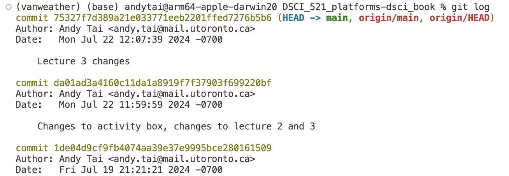
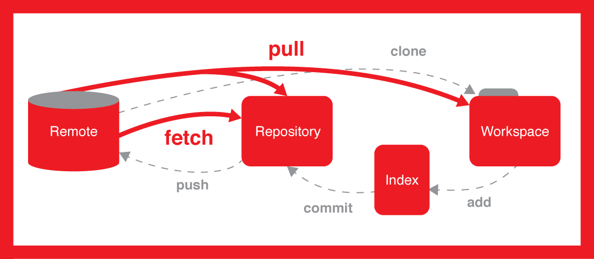
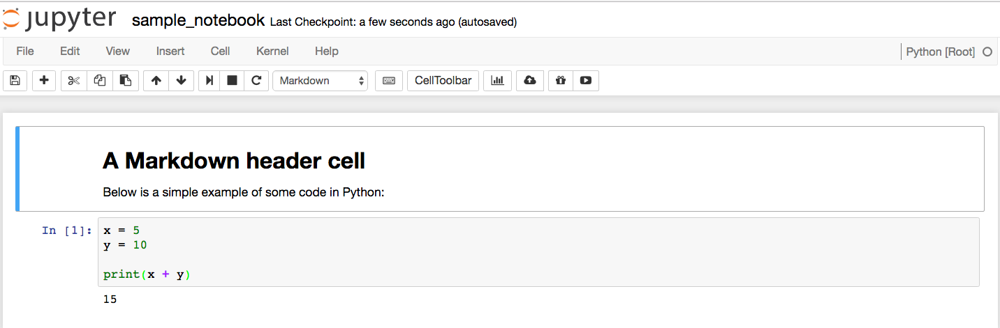

## Learning outcomes



**Platform in focus** Git and GitHub

## Introduction

In this lecture, we'll explore how to view your Git history and restore older versions of files. Understanding your project's history is crucial for tracking changes and fixing mistakes. Let's dive into the different methods for accessing your commit history and how to revert to previous file versions when needed.

# Viewing your Git history and restoring an older version of the file

Do you remember the commit messages that we used to write at the time of making a commit, for saving the state of a project?
It is possible to have a look at the history of the full project with any of these 3 different methods

You can view the Git history of a project in two main ways.

On the remote, you can use GitHub through the repository's code commit view.

On your computer, you can use Jupyter Lab through the repository's code commit view or the terminal by using the git log command.

Notes:
Now we have a project, but only 2 commits (the initial creation and adding us as the author). Let's now add a couple more commits to generate a history that we can view and experiment with by editing our `README.md`.

### Steps to follow:

* Step 1: Use the pen tool to change the README header from the default (repo name) to a more proper English title for the project. Click on the big green button "Commit changes" to save your work.

* Step 2: Use the pen tool to add today's date as the project start date to the README. Click on the big green button "Commit changes" to save your work.

* Step 3: Use the pen tool to add a fictional list of software dependencies for your project (e.g. R and Python) to the README. Click on the big green button "Commit changes" to save your work.

* Step 4: "Accidentally" delete the list of dependencies you just created. Click on the big green button "Commit changes" to save your work.

* Step 5: Bring all these changes down to your local computer by typing `git pull` from inside the cloned repo on your laptop using Git Bash/terminal (hint - open the file locally to see that it looks as expected to ensure you did things correctly).

On GitHub, on the repo's landing page click "*N* commits" link
(where *N* is the number of commits made on the repo).
Now we have a project, but only 3 commits. You can identify all parts of each commit,
including the day it was made, author, hash.
You can also go back to the repository at the moment of making this change
by clicking the `<>` button.

If you want to access your project information using the terminal you can use the `git log` command.
Pay attention that here you are looking at the long version of the hash
and not the 7-character long version displayed by default in Jupyter Lab or GitHub.
In both cases, you will be able to identify the commit using its hash.



Adding the flag `--oneline` to the command `git log` will provide you a different format
for the output, in this case, you get a succint version of the information of each commit.

The terminal allows greater flexibility when it comes to obtaining information about your project.
If you would like to know what other possibilities you have for using the `git log` command,
you can access the help by typing the command `git log --help`.

We have covered three distinct methods for viewing your project's history.
Prior to starting the activities, give them a try yourself in an example Git repository!

## Viewing the history of a project

There are two ways to view the Git history of a project: you can either use the repository's code commit view on GitHub, or you can use the `git log` command on your local machine.

### Steps to follow:

* Step 1: On GitHub, on the repo's landing page click "$N$ commit" link (where $N$ is the number of commits made on the repo, yours should be around 6).
* Step 2: On your laptop, from inside your Git repository type `git log` at the command line. You can use `git log --oneline` for more succinct output or the alias shortcut `gl` that we created.
   - You can navigate this log by scrolling with the mouse, arrow keys, or by the same commands we used with `man` in the first lecture
       - <kbd>q</kbd> = quit
       - <kbd>b</kbd> / <kbd>Space</kbd> = up/down
       - <kbd>/</kbd> + search term + <kbd>Enter</kbd> = search for a word
       - <kbd>n</kbd> / <kbd>N</kbd> go to next/previous match for the search term
           - You don't need to memorize these commands, they're here as a resource if you wish to use them instead of the mouse and arrow keys.

:::{.activity}
What are the main methods to view your Git history?

A. Using GitHub through the repository’s code commit view

B. Using Jupyter Lab through the repository’s code commit view

C. Using the terminal with the `git log` command

D. All of the above
:::

### Reflection point

How similar are the local and webpage log views?? Do you get the same information from both? Which seems easier to read/navigate?

## Comparing commits with `git diff`

`git log` tells you *which* commits exist.
`git diff` tells you *what changed*.

### Comparing changes you have not committed yet

Say you edited `README.md` twice:
you staged the first edit with `git add`, then kept working.
`git status` reports the two edits separately:

```out
On branch main
Changes to be committed:
  (use "git restore --staged <file>..." to unstage)
	modified:   README.md

Changes not staged for commit:
  (use "git add <file>..." to update what will be committed)
  (use "git restore <file>..." to discard changes in working directory)
	modified:   README.md
```

`git diff` shows the changes that are **not** staged,
the second group in that output:

```out
diff --git a/README.md b/README.md
index 8656b4a..20244b2 100644
--- a/README.md
+++ b/README.md
@@ -6,3 +6,5 @@ Start date: 2026-09-01
 
 - Python 3.12
 - R
+
+## Usage
```

`git diff --staged` shows the changes that **are** staged,
the ones that will go into your next commit:

```out
diff --git a/README.md b/README.md
index fbb4751..8656b4a 100644
--- a/README.md
+++ b/README.md
@@ -4,5 +4,5 @@ Start date: 2026-09-01
 
 ## Dependencies
 
-- Python
+- Python 3.12
 - R
```

So the two commands match the two headings in `git status`:

| `git status` heading | Command that shows those changes |
|---|---|
| `Changes to be committed` | `git diff --staged` |
| `Changes not staged for commit` | `git diff` |

To read a diff:

- `---` is the old version of the file, `+++` is the new one.
- `@@ -4,5 +4,5 @@` says which lines this chunk covers.
- Lines starting with `-` were removed, lines starting with `+` were added.
- Lines starting with a space are unchanged, and are shown for context.

A changed line shows up as a `-` and a `+` pair,
because Git works line by line:
it does not know you edited part of a line,
only that the old line went away and a new one took its place.

### Comparing two commits

Take this history:

```out
f3db3d9 Add dependency list
1f0d470 Make heading more precise
42fc6a8 Initial commit
```

Give `git diff` two SHAs and it compares them, oldest first:

```bash
git diff 42fc6a8 f3db3d9
```

```out
diff --git a/README.md b/README.md
index f538d05..fbb4751 100644
--- a/README.md
+++ b/README.md
@@ -1,3 +1,8 @@
-# Project
+# Milk Tea Analysis
 
 Start date: 2026-09-01
+
+## Dependencies
+
+- Python
+- R
```

Give it a single SHA, as in `git diff 1f0d470`,
and it compares that commit to the files you have right now.

Order matters.
Swapping the two SHAs swaps the `-` and `+` lines,
which makes it look like the change happened backwards.

### Comparing commits on GitHub

On GitHub, click any commit in the "*N* commits" list
to see the same information as `git diff`,
with removals in red and additions in green.

To compare two commits that are not next to each other,
use the compare view by adding `/compare/<older-sha>..<newer-sha>`
to the repository URL:

```out
https://github.ubc.ca/mds-2026-27/DSCI_521_lab1_ilm/compare/42fc6a8..f3db3d9
```

Everything `git diff` can do is in
[the official `git diff` documentation](https://git-scm.com/docs/git-diff).

## Restoring an older version of a file

Oh no! We realize by viewing the history that we made a mistake! We didn't mean to delete our list of dependencies. Worry not! We can now take advantage that we have been tracking this file under version control by using `git restore` to retrieve an older version of the file to replace the current version.

Let's restore the version of the file BEFORE we deleted the software dependency list.

### Steps to follow:

* Step 1: Examine the log to identify the version of the file you want to revert to and note its short SHA-1 (the first few characters of the commit ID). You'll need this to specify the exact point in time from which to retrieve the file.

* Step 2: Next, use the `git restore` command in the terminal to retrieve the file: `git restore --source SHORT_SHA-1 FILENAME` (you can also use `-s` as a shorthand for `--source`).

* Step 3: When restoring the file, it is added to the working area. To save the restored version of the file to the Git repository, you need to `add` and `commit` it, just like any other modification.

* Step 4: Don't forget to run `git push` to back up the file on GitHub!

# Deal with merge conflicts at the command line

When you run `git pull` git will do two things for you: it will `fetch` the content from the remote and then `merge` it into your repository. When you are working alone on a repository git will likely be able to do these two things automatically every time you `pull`, and you don't need to intervene manually.

However, when working with collaborators there are usually changes made in more than one place (e.g., you made changes in the local repo on your laptop at the same time as your collaborator updated the remote repo on GitHub). Eventually, the same document will have been changed in different places and this can create issues for git regarding how to consolidate and `merge` these changes together. There are two distinct merge scenarios for when a document is changed in two places:

* Place 1: Changes to a document where different lines are modified (Git can automatically merge these and will do so when you `pull`).

* Place 2: Changes to a document where the same line(s) are modified (Git CANNOT automatically merge these and will complain that you have a "merge conflict" when you `pull`).

In the second case, you have to help git by telling it which changes you want to keep. Git kindly points you to where the problem is in the output from `git pull` where it mentions which files have been modified from two source. You will need to edit this file to make it look how you want and then `add` it to the staging area and `commit`.



## How do you know you have a merge conflict?

You usually find out when you try to `push` and Git refuses.
Two different problems cause that rejected push,
and only the second one is a merge conflict:

1. Your branch and the remote branch have *diverged*,
   and Git wants you to say how to reconcile them.
2. Git tried to reconcile them and could not,
   because the same lines were changed in both places.

You have to fix the first problem before you find out
whether you have the second one.

### Problem 1: your branch and the remote have diverged

You commit some changes locally,
and changes were also made on GitHub
(by a collaborator, by you on a different computer,
or by you editing a file in the GitHub web interface).
`git status` shows that the two histories have drifted apart:

```out
On branch main
Your branch and 'origin/main' have diverged,
and have 2 and 14 different commits each, respectively.
  (use "git pull" if you want to integrate the remote branch with yours)

nothing to commit, working tree clean
```

If you try to `git push origin main` in this state,
the push is rejected:

```out
To github.ubc.ca:mds-2026-27/DSCI_521_lab1_ilm.git
 ! [rejected]        main -> main (non-fast-forward)
error: failed to push some refs to 'github.ubc.ca:mds-2026-27/DSCI_521_lab1_ilm.git'
hint: Updates were rejected because the tip of your current branch is behind
hint: its remote counterpart. If you want to integrate the remote changes,
hint: use 'git pull' before pushing again.
hint: See the 'Note about fast-forwards' in 'git push --help' for details.
```

The remote has changes you do not have,
and Git will not let you `push` until you `pull` them down.

So you run `git pull origin main`, and Git refuses again:

```out
From github.ubc.ca:mds-2026-27/DSCI_521_lab1_ilm
 * branch            main       -> FETCH_HEAD
hint: You have divergent branches and need to specify how to reconcile them.
hint: You can do so by running one of the following commands sometime before
hint: your next pull:
hint:
hint:   git config pull.rebase false  # merge
hint:   git config pull.rebase true   # rebase
hint:   git config pull.ff only       # fast-forward only
hint:
hint: You can replace "git config" with "git config --global" to set a default
hint: preference for all repositories. You can also pass --rebase, --no-rebase,
hint: or --ff-only on the command line to override the configured default per
hint: invocation.
fatal: Need to specify how to reconcile divergent branches.
```

:::{.callout-important}
`fatal: Need to specify how to reconcile divergent branches` does **not** mean
you have a merge conflict.
Git has not tried to combine the two histories yet.
It will not guess whether you want to *merge* or *rebase*,
and it will keep refusing until you tell it.
:::

When you see this, run this one command:

```bash
git config pull.rebase false
```

This tells Git that in this repository,
`pull` reconciles divergent branches by **merging**.
That was Git's default in older versions,
and it is what we use in this course.
Merging leaves your commits and the remote's commits as they are,
so when something goes wrong it is easier to see what happened and recover.

:::{.callout-note}
`git config pull.rebase false` records a setting, it does not pull anything.
You still need to run `git pull origin main` afterwards.

Run it once per repository.
To set it for every repository on your computer,
run `git config --global pull.rebase false` instead.
:::

Once Git knows how to reconcile, one of two things happens.

### Outcome A: Git merges the changes for you

If the changes are on different lines,
Git merges them for you and reports the merge commit:

```out
From github.ubc.ca:mds-2026-27/DSCI_521_lab1_ilm
 * branch            main       -> FETCH_HEAD
Merge made by the 'ort' strategy.
 README.md      | 4 ++++
 analysis.ipynb | 2 +-
 2 files changed, 5 insertions(+), 1 deletion(-)
```

There is nothing to fix.
`git push origin main` now works:

```out
Enumerating objects: 35, done.
Counting objects: 100% (34/34), done.
Delta compression using up to 8 threads
Compressing objects: 100% (30/30), done.
Writing objects: 100% (31/31), 2.46 MiB | 10.86 MiB/s, done.
Total 31 (delta 3), reused 0 (delta 0), pack-reused 0 (from 0)
To github.ubc.ca:mds-2026-27/DSCI_521_lab1_ilm.git
   37deb72..ded3e69  main -> main
```

### Outcome B: you have a merge conflict

If the *same lines* were changed in both places,
Git cannot decide for you.
The same `git pull origin main` ends with extra lines:

```out
From github.ubc.ca:mds-2026-27/DSCI_521_lab1_ilm
 * branch            main       -> FETCH_HEAD
Auto-merging README.md
CONFLICT (content): Merge conflict in README.md
Automatic merge failed; fix conflicts and then commit the result.
```

This is a merge conflict.
The words to look for are `CONFLICT` and `Automatic merge failed`.
Git names the file it could not merge, `README.md` here.

`git status` confirms where you are and what to do next:

```out
On branch main
Your branch and 'origin/main' have diverged,
and have 1 and 1 different commits each, respectively.
  (use "git pull" if you want to integrate the remote branch with yours)

You have unmerged paths.
  (fix conflicts and run "git commit")
  (use "git merge --abort" to abort the merge)

Unmerged paths:
  (use "git add <file>..." to mark resolution)
	both modified:   README.md

no changes added to commit (use "git add" and/or "git commit -a")
```

The file is listed under **Unmerged paths** as `both modified`:
you and someone else edited it, and you have to pick what to keep.

Merge conflicts are not bad.
They happen to everyone,
and you need to know how to tell Git what to do.

:::{.callout-tip}
Changed your mind?
`git merge --abort` undoes the merge and puts your repository back
where it was before you pulled.
Nothing is lost and you can try again.
:::

:::{.activity}
What of the following practices do you think could be a good idea in order to avoid having merge conflicts?

A. Push changes to the remote repository daily before starting to work on your local changes.

B. Pull changes to the remote repository daily before starting to work on your local changes.

C. Stash changes using the terminal before pulling potentially new conflicting information from the remote repository.

D. Work only locally or only in the remote repository.
:::


## What do you do to fix a merge conflict?
### Steps to follow:

* Step 1: Open the file that has a conflict (the output of `git pull` will tell you which files) in a plain text editor (e.g., VS Code).

* Step 2: Look for the conflict (hint: search for `<<<<<<< HEAD`).

* Step 3: Fix the conflict by deleting everything you don't want to keep in the file, including the `<<<<<`, `=====`, and `>>>>>` markers that Git added. Note: VS Code will help you with this by color highlighting the changes and providing buttons you can click to accept either the current or incoming change (or both). Using these buttons instead of modifying the file manually can save you from mistakes that can take a lot of time to troubleshoot and fix, so we highly recommend using this feature.

* Step 4: After the file looks as you want it, `add` it and `commit` your changes. Then you can `push` them up to GitHub.

Here's an example of a text file with a conflict and how it can look after you have resolved it:

```{.default filename="README.md"}
Some text up here
that is not part of the merge conflict,
but just included for context.
<<<<<<< HEAD
We added this line in our last commit
=======
This line was added somewhere else
>>>>>>> dabb4c8c450e8475aee9b14b4383acc99f42af1d
```

- `<<<<<<< HEAD` precedes the change you made (that you couldn't push)
- `=======` is a separator between the conflicting changes
- `>>>>>>> dabb4c8c450e8475aee9b14b4383acc99f42af1d` flags the end of the conflicting change you pulled from GitHub

Here we keep both lines,
so we delete the three marker lines and leave the rest:

```{.default filename="README.md"}
Some text up here
that is not part of the merge conflict,
but just included for context.
We added this line in our last commit
This line was added somewhere else
```

You are not limited to the lines Git offers you.
Keeping neither and writing something new is a perfectly good resolution:

```{.default filename="README.md"}
Some text up here
that is not part of the merge conflict,
but just included for context.
We combined both lines by hand while resolving the conflict.
```

Now `git add README.md`.
`git status` shows the conflict is settled but the merge is not finished:

```out
On branch main
Your branch and 'origin/main' have diverged,
and have 1 and 1 different commits each, respectively.
  (use "git pull" if you want to integrate the remote branch with yours)

All conflicts fixed but you are still merging.
  (use "git commit" to conclude merge)

Changes to be committed:
	modified:   README.md
```

`git commit -m "Resolve merge conflict in README.md"` concludes the merge:

```out
[main 8aa69f2] Resolve merge conflict in README.md
```

Your history now contains the remote's work,
so `git push origin main` is accepted:

```out
Enumerating objects: 10, done.
Counting objects: 100% (10/10), done.
Delta compression using up to 8 threads
Compressing objects: 100% (4/4), done.
Writing objects: 100% (6/6), 616 bytes | 616.00 KiB/s, done.
Total 6 (delta 1), reused 0 (delta 0), pack-reused 0 (from 0)
To github.ubc.ca:mds-2026-27/DSCI_521_lab1_ilm.git
   fbb6482..8aa69f2  main -> main
```


:::{.activity}
True or False?

You can solve a merge conflict by not accepting either the current changes or the incoming changes.
:::


## Conflicts that are not about lines

Not every conflict is two people editing the same line.
If you delete a file while someone else edits it,
Git cannot decide whether the file should exist,
and reports a `modify/delete` conflict:

```out
CONFLICT (modify/delete): notes.md deleted in HEAD and modified in 8a4a9c4.  Version 8a4a9c4 of notes.md left in tree.
Automatic merge failed; fix conflicts and then commit the result.
```

There are no `<<<<<<<` markers to edit here,
because there is nothing to mark up.
Git leaves the other person's version of the file in your working directory
and `git status` describes the conflict as `deleted by us`:

```out
Unmerged paths:
  (use "git add/rm <file>..." as appropriate to mark resolution)
	deleted by us:   notes.md
```

You resolve it by saying which outcome you want:

- `git add notes.md` keeps the file, with the other person's changes.
- `git rm notes.md` confirms the deletion.

Then `git commit` as usual.
The other kinds of conflict Git can report are listed in
[the `git merge` documentation](https://git-scm.com/docs/git-merge#_how_conflicts_are_presented).

## What about merge conflicts of Jupyter notebooks?

### First - a bit about what a Jupyter notebook is made up of

- `.ipynb` files are "plain" text files, and we can view them in a plain text editor and make some sense of them
- The contents of the notebook are encoded in JSON format, which means that there are many brackets in the file,
  which can make it hard to read for humans (but easy for machines).

For example, this notebook of 2 cells:



is encoded by the following JSON:
```{.json filename="sample_notebook.ipynb"}
{
 "cells": [
  {
   "cell_type": "markdown",
   "metadata": {},
   "source": [
    "# A Markdown header cell\n",
    "\n",
    "Below is a simple example of some code in Python:"
   ]
  },
  {
   "cell_type": "code",
   "execution_count": 1,
   "metadata": {
    "collapsed": false
   },
   "outputs": [
    {
     "name": "stdout",
     "output_type": "stream",
     "text": [
      "15\n"
     ]
    }
   ],
   "source": [
    "x = 5\n",
    "y = 10\n",
    "\n",
    "print(x + y)"
   ]
  }
 ],
 "metadata": {
  "anaconda-cloud": {},
  "kernelspec": {
   "display_name": "Python [Root]",
   "language": "python",
   "name": "Python [Root]"
  },
  "language_info": {
   "codemirror_mode": {
    "name": "ipython",
    "version": 3
   },
   "file_extension": ".py",
   "mimetype": "text/x-python",
   "name": "python",
   "nbconvert_exporter": "python",
   "pygments_lexer": "ipython3",
   "version": "3.5.1"
  }
 },
 "nbformat": 4,
 "nbformat_minor": 0
}
```

## Version control and Jupyter notebooks

Notebooks are plain text, so Git can track them,
but the JSON above shows the problem:
a one-line edit to a cell can move execution counts, outputs and metadata around,
and a conflict in the middle of that is painful to fix by hand.
If you have ever resolved a notebook conflict by deleting the file
and re-downloading it, this is why.

Three things make notebooks much easier to live with:

- **Commit early and commit often.** Most notebook conflicts happen because
  two people changed the same notebook over a long stretch of time.
  Small commits and frequent pulls are still the best defence.

- **Clear your outputs before committing.** Outputs are the bulkiest and most
  conflict-prone part of the JSON, and they can be regenerated.
  [`nbstripout`](https://github.com/kynan/nbstripout) can do this automatically
  every time you commit.

- **Use a notebook-aware diff tool.**
  [`nbdime`](https://nbdime.readthedocs.io/) understands notebook structure,
  so it compares cells instead of JSON.
  `nbdiff` and `nbmerge` are its command line versions,
  and `nbdiff-web` and `nbmerge-web` open a side-by-side view in your browser.
  Once installed, `nbdime config-git --enable --global` makes `git diff` and
  `git merge` use it for `.ipynb` files automatically.

VS Code and Positron also render notebook diffs cell by cell
in their Source Control panes,
which is often enough to see what changed without leaving the editor.

If a notebook conflict does get away from you,
`git merge --abort` puts you back where you started
so you can pull again with one of these tools in place.

# Stashing local non-committed changes before pulling

We have learned that if there are changes on your remote repo in GitHub
and you already have local committed changes,
you will need to `pull` before you can `push`.
If the local and remote changes are in the same lines,
you will have to resolve the resulting merge conflict,
otherwise git will merge automatically.
But what if you have just started to make changes to a file when you realize that you forgot to pull
before you started to work?
The first thing to do is to try to `pull`,
if you're lucky there are either no new changes
or they are not in the same file you modified.
If they are in the same file,
you will get an error message like this:

```out
error: Your local changes to the following files would be overwritten by merge:
        README.md
Please commit your changes or stash them before you merge.
Aborting
```

As you can see,
you could finish off your changes,
`add` them,
`commit` them,
and then `pull`.
This is possible if the changes you are about to make locally
will not affect the files that have been updated remotely.
However,
if you're about to change some of the files that have also been changed remotely
it is better to run `git stash`,
which removes your local changes from the working area
and and saves them in another location
(you can think of this as a secrete pocket which git does not care about when pulling from the remote repo,
and from which you can take out the changes again when you need them).
You can then do `git pull`,
and follow up with a `git stash pop` to put your changes back from the stash to the working area,
and then carry on working.

This workflow can save you from running into merge conflicts,
as long as you have not already made modifications to the same lines as you are pulling down.
If you have already modified the same file that was updated remotely,
you will still run into a merge conflict when you do `git stash pop`.
Stashing is also great when you are working on one feature
but realize that you should actually work on another unrelated feature first,
you can stash your existing work (instead of manually saving it elsewhere)
and finish working on the most urgent feature first.

# Tell Git to ignore irrelevant files using a `.gitignore` file

You may have encountered this before:

```bash
git status
```

```out
On branch main
Untracked files:
  (use "git add <file>..." to include in what will be committed)

	.ipynb_checkpoints/
	.DS_Store

no changes added to commit (use "git add" and/or "git commit -a")
```

Git is letting us know about untracked files (ones we have never committed before). We don't care about these files. We'd prefer not to have them clutter our view (so we can pay attention to files we do want to track). What do we do?

## Create a `.gitignore` file

Using the plain text editor of your choice (mine is VS Code) create a file called `.gitignore` inside your Git repo. To do this with VS Code, I would type:

```bash
code .gitignore
```

Inside the text file, list the files and folders you would like to ignore, one per line. For example:

```{.default filename=".gitignore"}
.ipynb_checkpoints/
.DS_Store
```

Save the file, and `add` and `commit` it with Git. Then try `git status` again. You should see:

```out
On branch main
nothing to commit, working tree clean
```

## `.gitignore` tips and tricks

Listing files one per line works, but gets tedious.
A `.gitignore` line can also be a pattern:

```{.default filename=".gitignore"}
# ignore every CSV file, anywhere in the repo
*.csv

# ...but keep this one
!data/lookup-table.csv

# ignore a folder and everything in it
output/

# ignore .ipynb_checkpoints in any subdirectory
**/.ipynb_checkpoints/
```

- `*` matches any part of a filename, so `*.csv` catches every CSV file.
- `!` un-ignores something that an earlier pattern caught.
  Order matters: the `!` line has to come after the pattern it is undoing.
- A trailing `/` means "this is a folder".
- `#` starts a comment.

The full pattern syntax is in
[the official `gitignore` documentation](https://git-scm.com/docs/gitignore).

:::{.callout-warning}
`.gitignore` only applies to files Git is **not already tracking**.

If you have already committed `data.csv`,
adding `*.csv` to `.gitignore` changes nothing,
and `git status` keeps reporting your edits to it:

```out
Changes not staged for commit:
	modified:   data.csv
```

You have to tell Git to stop tracking it first:

```bash
git rm --cached data.csv
```

This removes the file from Git while leaving it on your computer.
Commit that change, and the `.gitignore` rule takes over from there.
Be aware that the file stays in the history of the commits you already made,
so this is not a way to remove a large file or a password from a repository.
:::

Consider also creating a [global `.gitignore` file](https://docs.github.com/en/get-started/git-basics/ignoring-files#configuring-ignored-files-for-all-repositories-on-your-computer)
so you do not have to write the same rules in every repository.

Let's create a `gitignore` file in our 521 lab 2 repo.

### Steps to follow:

* Step 1: Use a text editor (e.g., VS Code, nano, Jupyter) to create a file called `.gitignore` in your 521 lab 2 repo.

* Step 2: Add `**/.ipynb_checkpoints/` to that file and save it.

* Step 3: Add and commit it with Git.

* Step 4: Type `git status` and see if you no longer see `.ipynb_checkpoints/` as an untracked file.


:::{.activity}
True or false?

The `.gitignore` file itself can be committed and pushed to a remote repository.
:::

# Time travelling with `git reset`

Sometimes you do not want to fix the current state of a file,
you want to move the whole branch back to an earlier commit.
That is what `git reset` does.

Say `git log --oneline` shows this:

```out
fb962e0 (HEAD -> main) Add md demo
bcb541e Make heading more precise
5c01f2f Initial commit
```

To move the branch back to "Make heading more precise",
we run `git reset bcb541e`.
Our log now shows this:

```out
bcb541e (HEAD -> main) Make heading more precise
5c01f2f Initial commit
```

What happened to the changes from commit `fb962e0`?
That depends on which flag you use.
The commit is gone either way,
but the *changes it contained* can end up in one of three places.

## The three flavours of `git reset`

By default, `git reset <sha>` puts the changes back in the working area,
as if you had made the edits but not run `git add` yet.
This is what the message after the reset is telling you:

```out
Unstaged changes after reset:
M       README.md
```

`git reset --soft <sha>` keeps the changes staged instead,
ready to commit again.
It prints nothing, but `git status` shows where the changes went:

```out
On branch main
Changes to be committed:
  (use "git restore --staged <file>..." to unstage)
	modified:   README.md
```

This is the one to reach for when you committed too early,
or wrote a commit message you regret:
reset, then commit again with everything already staged.

`git reset --hard <sha>` throws the changes away.
It prints nothing either, because there is nothing left to report.
After `git reset --hard 5c01f2f` our log is just:

```out
5c01f2f (HEAD -> main) Initial commit
```

| Flag | The commits are | Your changes end up |
|---|---|---|
| `--soft` | removed from the branch | staged |
| (none, `--mixed`) | removed from the branch | in the working area, unstaged |
| `--hard` | removed from the branch | discarded |

The details are in
[the official `git reset` documentation](https://git-scm.com/docs/git-reset).

:::{.callout-warning}
`--hard` is the only one of the three that destroys work.
Run `git status` before you use it,
and make sure you do not need anything it is about to discard.
:::

## Are the changes lost forever?

Not immediately.
Git keeps a record of everywhere your branch has been in its "reflog".
Commits that are no longer part of any branch are called "dangling",
and they are cleared out at intervals rather than right away.
So if you realise the mistake straight away,
`git reset bcb541e` moves you forward again to the commit you just "deleted".

**Do not rely on this.**
Once Git clears the reflog, those changes are gone for good.

## Undoing a commit without rewriting history

`git reset` works by pretending a commit never happened,
which is a problem once that commit is on GitHub
and other people have it.

`git revert <sha>` is the safe alternative.
Instead of removing the old commit,
it makes a **new** commit that undoes it,
so the history stays intact and everyone else stays in sync.
See [the official `git revert` documentation](https://git-scm.com/docs/git-revert).

## Syncing with a remote after resetting

If the commit you reset away is already on GitHub,
your local history is now *behind* the remote,
and Git refuses to push.
To overwrite what is on GitHub with your reset history, use:

```bash
git push --force-with-lease origin main
```

The "lease" is a safety check.
Git overwrites the remote only if the remote is still where you last saw it.
If someone pushed something in the meantime,
your push is rejected instead of quietly destroying their work:

```out
 ! [rejected]        main -> main (stale info)
error: failed to push some refs to 'github.ubc.ca:mds-2026-27/DSCI_521_lab1_ilm.git'
```

`stale info` means "the remote moved and you have not looked at it yet".
Run `git fetch origin`, see what arrived,
decide what to do with it,
and then push again.

When the lease holds, Git tells you it rewrote the remote:

```out
 + 7c2695a...b78bf16 main -> main (forced update)
```

:::{.callout-important}
**Always `--force-with-lease`, never `--force`.**

You will also see `git push --force` (or `-f`) written in blog posts and
answers online.
It does the same thing without the safety check:
it overwrites the remote no matter what is there,
so any commits pushed since you last fetched are gone,
and nothing warns you first.
`--force-with-lease` gives you the same power and catches that mistake,
so there is no reason to use the shorter one.
:::

Even with the lease, you are rewriting history that other people may have
already pulled, so they will be out of sync with the remote.
Force pushing is fine when the repository is yours alone,
and something to agree on first when it is not.
When in doubt, prefer `git revert <sha>`:
it undoes the change with a new commit
and leaves the shared history alone.

See [the official `git push` documentation](https://git-scm.com/docs/git-push#Documentation/git-push.txt---force-with-lease).

# Other useful Git commands

These are not part of the workflow you need for the labs,
but you will see them referred to often enough to be worth knowing about.

## `git fetch`

Earlier we said that `git pull` does two things:
it *fetches* the commits from the remote,
then *merges* them into your branch.

`git fetch` does only the first half
(this is the split shown in the figure at the start of the merge conflict section).
It downloads the new commits and updates `origin/main`,
your local record of where the remote branch is,
but leaves your own files untouched:

```out
From github.ubc.ca:mds-2026-27/DSCI_521_lab1_ilm
   0e38f69..ada2b64  main       -> origin/main
```

Nothing in your working directory changed,
and `git status` now tells you what is waiting:

```out
On branch main
Your branch is behind 'origin/main' by 1 commit, and can be fast-forwarded.
  (use "git pull" to update your local branch)

nothing to commit, working tree clean
```

This is useful when you want to look before you leap.
`git log --oneline main..origin/main` lists the commits you are about to receive,
and `git diff main origin/main` shows what they change.
When you are happy, `git pull` brings them in.

See [the official `git fetch` documentation](https://git-scm.com/docs/git-fetch).

## Two different `git restore` commands

`git restore` does different things depending on the flag,
and the two uses are easy to confuse:

| Command | What it does |
|---|---|
| `git restore <file>` | Throws away uncommitted changes in the working area |
| `git restore --staged <file>` | Unstages a file, keeping your changes |
| `git restore --source <sha> <file>` | Brings back the version of a file from an older commit |

Only the last one reaches into the history,
and it is the one we used earlier in this chapter.
See [the official `git restore` documentation](https://git-scm.com/docs/git-restore).

### Exercise: Accessing and Working with GitHub

:::{.exercise}
**Accessing and Working with GitHub**

**Objective:** By completing this exercise, students will gain hands-on experience in accessing their GitHub home for MDS, creating, cloning, modifying, and pushing changes to a GitHub repository.

**Instructions:**

1. **Access Your GitHub Home for MDS:**
   - Open your web browser and navigate to:

   `https://github.ubc.ca/MDS-2021-22/yourCWL_home`

   - Replace `yourCWL` with your actual CWL.
   - Here you will find links to all the courses' repositories and labs' repositories.
   - **Hint:** Bookmark this page for easy access to all relevant courses' repositories.

2. **Create a New Repository on GitHub:**
   - Visit [GitHub.com](https://docs.github.com/en/github/creating-cloning-and-archiving-repositories/creating-a-new-repository).
   - Create a new repository and ensure you add a README file during the setup process.

3. **Clone the Repository:**
   - Clone the newly created repository to your local machine.
   - Note: If your GitHub username is different from the username on your computer, you will need to configure your Git settings accordingly.

   ```bash
   git clone https://github.com/YOUR_GITHUB_USERNAME/YOUR_REPOSITORY_NAME.git
   ```

4. **Make Changes to the README File:**
   - Open the README file in a text editor.
   - Add some content or modify the existing content.
   - Save your changes.

5. **Add and Commit Your Changes:**
   - Stage the changes you made to the README file.

   ```bash
   git add README.md
   ```

   - Commit the changes with a descriptive message.

   ```bash
   git commit -m "Updated README with new content"
   ```

6. **Create a New File, Add, and Commit It:**
   - Create a new file in the repository (e.g., `newfile.txt`).
   - Add some content to the new file and save it.
   - Stage the new file.

   ```bash
   git add newfile.txt
   ```

   - Commit the new file with a descriptive message.

   ```bash
   git commit -m "Added newfile.txt with initial content"
   ```

7. **Push Your Changes to GitHub:**
   - Push the changes from your local repository to the remote repository on GitHub.

   ```bash
   git push origin main
   ```

8. **Confirm Your Changes on GitHub:**
   - Go to your GitHub repository page.
   - Confirm that the changes to the README file and the new file (`newfile.txt`) are reflected in the repository.

9. **View Your Git History:**
   - On GitHub, click on the "Commits" link on the repository’s landing page.
   - On your local machine, use the `git log` command to view the commit history.

   ```bash
   git log
   ```

   - Use the `git log --oneline` command for a more concise view.

   ```bash
   git log --oneline
   ```

10. **Restore an Older Version of a File:**
    - Identify the commit hash for the version you want to restore.
    - Use the `git restore` command to revert to that version.

    ```bash
    git restore --source SHORT_SHA-1 FILENAME
    ```

    - Stage and commit the restored file.

    ```bash
    git add FILENAME
    git commit -m "Restored FILENAME to previous version"
    ```

    - Push the changes to GitHub.

    ```bash
    git push origin main
    ```

**Questions:**

1. What are the steps to access your GitHub home for MDS?
2. What are the steps to create a new repository on GitHub?
3. What command do you use to clone a repository to your local computer?
4. How do you add and commit changes to a file in a Git repository?
5. What command do you use to push changes to GitHub?
6. How do you view your Git history?
7. How do you restore an older version of a file in a Git repository?
:::
